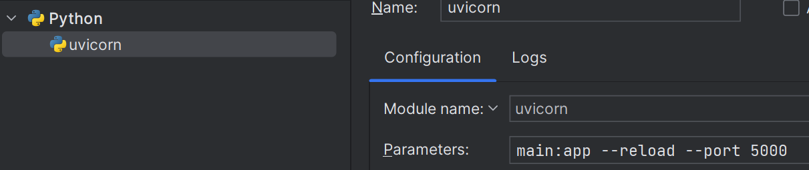

## Begin Project

```shell
uvicorn main:app --reload
```

## PyCharm Configuration

- Switch to `Module name`
- Select `uvicorn`
- Set parameters as `main:app --reload --port 5000`

    

## API Specification

- `http://127.0.0.1:5000/docs`

  